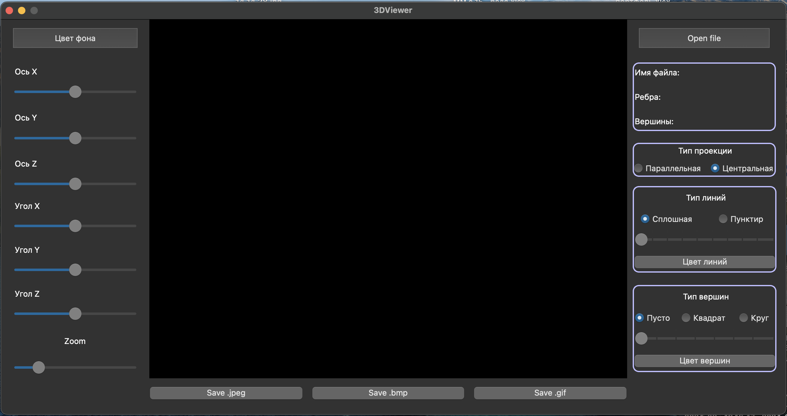
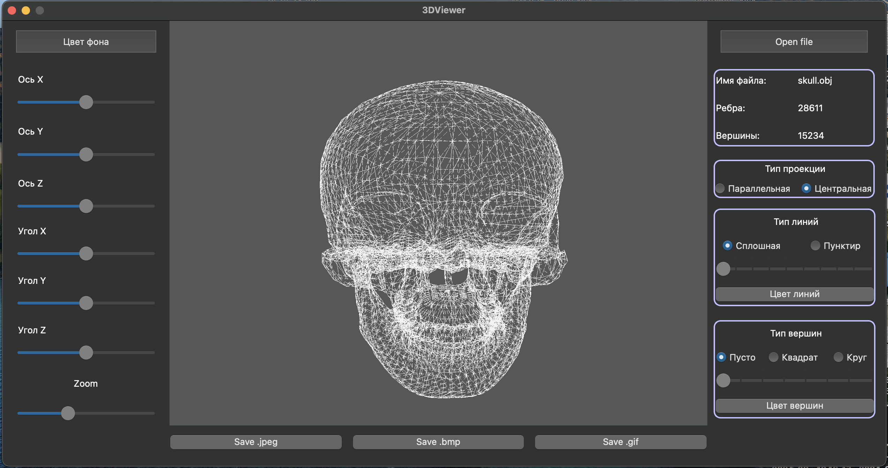
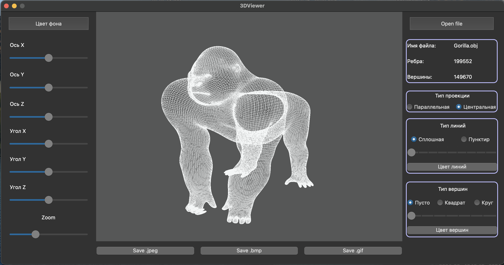
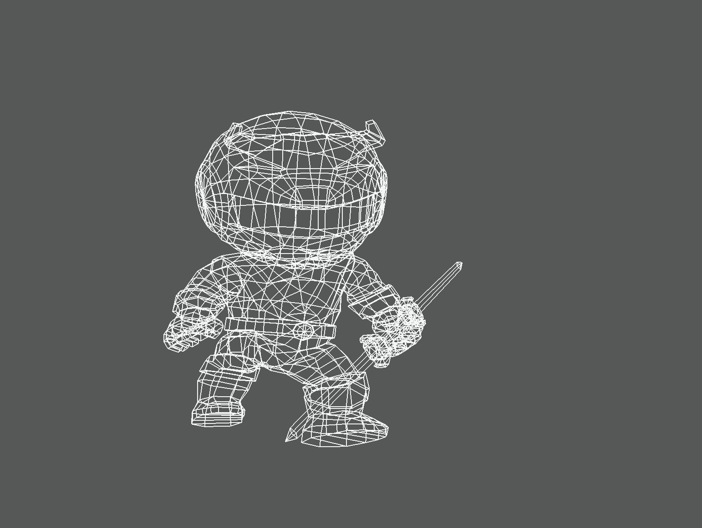

# s21_3DViewer

## Introduction

The `s21_3DViewer` project is a custom implementation of a 3D object viewer developed in C. This project allows users to load and visualize 3D models in `.obj` format, providing basic manipulations like zooming, rotating, and moving the object. The goal of the project is to enhance knowledge in 3D graphics, algorithms, and user interface design.

### Overview of 3D Viewer Features

| No. | Feature              | Description                                         |
| --- | -------------------- | --------------------------------------------------- |
| 1   | **Zoom**             | Allows users to zoom in and out on the 3D object    |
| 2   | **Rotation**         | Users can rotate the object around the X, Y, and Z axes |
| 3   | **Movement**         | Enables movement of the object within the viewer's window |
| 4   | **Load OBJ**         | Supports loading 3D models in the `.obj` file format |
| 5   | **Wireframe Mode**    | Displays the object in wireframe view               |
| 6   | **Surface Mode**     | Renders the object with surfaces                    |
| 7   | **File Export**      | Exports the 3D model image as a screenshot          |

## Part 1. Implementation of the `s21_3DViewer` Features

The core functionality of the 3D viewer includes loading `.obj` files, rendering objects, and providing interactive features like zoom, rotation, and movement. The following principles were followed during the development:

- Developed in C, adhering to the C11 standard using the gcc compiler.
- OpenGL and GLU libraries were used for rendering 3D objects.
- The source code follows Google Style guidelines for clean and readable code.
- The project is structured as a static library, `s21_3DViewer.a`, with its corresponding header file `s21_3DViewer.h`.
- The program processes `.obj` files and parses their vertices, edges, and surfaces.
- The viewer supports switching between wireframe and surface rendering modes.
- Allows for real-time interaction such as zooming and rotating.
- Unit tests were developed to validate the functionality using the Check library.
- The project includes a Makefile for building the viewer and running tests.

## Part 2. Additional Features - Settings

- The program allows users to customize the type of projection (parallel and central);
- It allows customization of the type (solid, dashed), color, and thickness of edges, as well as the display style (none, circle, square), color, and size of vertices;
- Users can select the background color;
- All settings are saved between program restarts.

## Part 3. Additional Features - Recording

- The program allows saving the rendered images in bmp and jpeg formats;
- A special button allows recording short screencasts (animations) of user-applied affine transformations of the loaded object in gif format (640x480, 10fps, 5s).

## Makefile Targets

The build of the program is managed by a Makefile with the standard set of targets for GNU programs:

- **make all**: This target compiles all source files and builds the terminal version of the 3D viewer using the `ncurses` library.
- **make clean**: This target removes all generated object files and executables, cleaning up the build environment.
- **make install**: This target installs the 3D viewer to a specified directory.
- **make uninstall**: This target removes the installed 3D viewer from the system.
- **make dvi**: This target builds documentation for the project.
- **make dist**: This target packages the project for distribution.
- **make tests**: This target runs unit tests to validate the functionality of the program.
- **make gcov_report**: This target generates a code coverage report in HTML format using `gcov` for the 3D viewer's logic.

## Project Build

To build the project, follow these steps:

1. Clone the repository and navigate to the project folder:

    ```bash
    git clone <repository_url>
    cd <project_folder>
    ```

2. Build the project:

    ```bash
    make all
    ```


## Screenshots and GIFs

Here are some visuals showcasing the 3D Viewer project in action, demonstrating various object renderings and features of the interface:

### Screenshots

| Initial Model Load | Custom Model View |
|-------------------|-------------------|
|  |  |
|  |  |
|  |  |

### GIF Example

Here is a GIF showing object manipulation:



This format beautifully demonstrates the interaction capabilities and control of 3D models within the viewer.

## Conclusion

The `s21_3DViewer` project demonstrates a basic 3D viewer in C with additional features such as customizable settings and recording capabilities. The structured programming principles and comprehensive testing ensure robustness and maintainability.