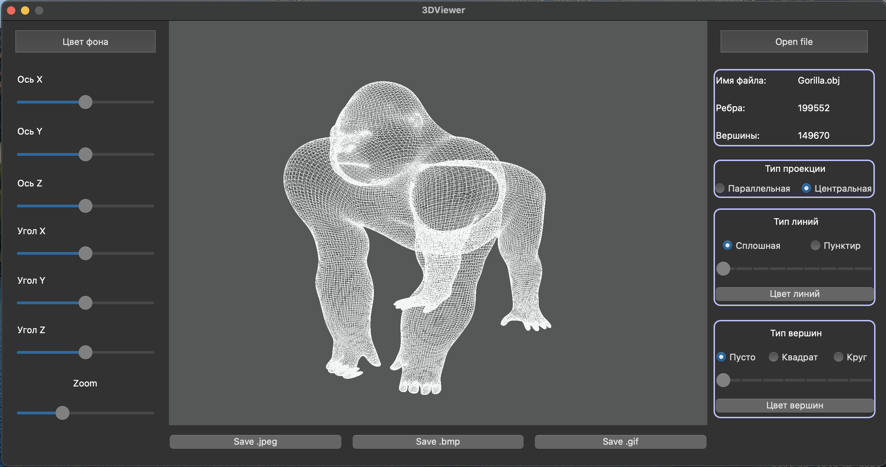
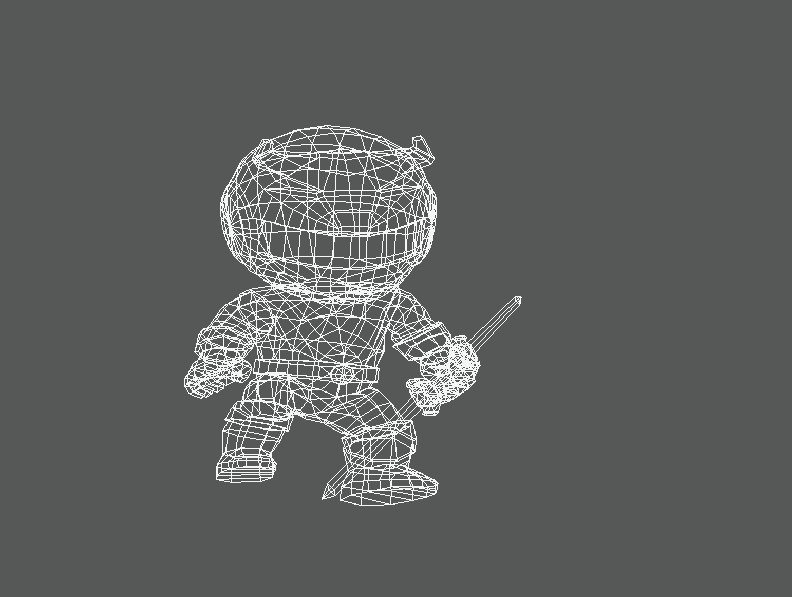

# s21_3DViewer

## Введение

Проект `s21_3DViewer` представляет собой реализацию программы для просмотра 3D объектов, разработанную на языке C. Эта программа позволяет пользователям загружать и визуализировать 3D модели в формате `.obj`, предоставляя возможности масштабирования, вращения и перемещения объекта. Цель проекта — углубить знания в области 3D графики, алгоритмов и разработки пользовательских интерфейсов.

### Обзор возможностей 3D Viewer

| №   | Возможность          | Описание                                               |
| --- | -------------------- | ------------------------------------------------------ |
| 1   | **Масштабирование**  | Позволяет увеличивать и уменьшать изображение 3D объекта |
| 2   | **Вращение**         | Пользователи могут вращать объект вокруг осей X, Y и Z  |
| 3   | **Перемещение**      | Возможность перемещать объект внутри окна программы     |
| 4   | **Загрузка OBJ**     | Поддержка загрузки 3D моделей в формате `.obj`          |
| 5   | **Каркасный режим**   | Отображает объект в каркасном виде                     |
| 6   | **Поверхностный режим** | Отображает объект с поверхностями                    |
| 7   | **Экспорт файлов**    | Экспорт изображений 3D модели в виде скриншотов        |

## Часть 1. Реализация функций `s21_3DViewer`

Основной функционал 3D Viewer включает в себя загрузку файлов `.obj`, рендеринг объектов и предоставление интерактивных возможностей, таких как масштабирование, вращение и перемещение. В процессе разработки были соблюдены следующие принципы:

- Разработано на языке C в соответствии со стандартом C11 с использованием компилятора gcc;
- Для рендеринга 3D объектов использовались библиотеки OpenGL и GLU;
- Код проекта соответствует правилам оформления кода по Google Style;
- Проект оформлен в виде статической библиотеки `s21_3DViewer.a` с заголовочным файлом `s21_3DViewer.h`;
- Программа обрабатывает файлы `.obj`, парсит вершины, рёбра и поверхности;
- Поддерживается переключение между каркасным и поверхностным режимами отображения;
- Реализовано взаимодействие в реальном времени: масштабирование и вращение объекта;
- Для валидации функционала написаны unit-тесты с использованием библиотеки Check;
- В проект включён Makefile для сборки программы и запуска тестов.

## Часть 2. Дополнительно. Настройки

- Программа позволяет настраивать тип проекции (параллельная и центральная);
- Позволяет настраивать тип (сплошная, пунктирная), цвет и толщину рёбер, способ отображения вершин (отсутствуют, круг, квадрат), их цвет и размер;
- Можно выбрать цвет фона;
- Настройки сохраняются между перезапусками программы.

## Часть 3. Дополнительно. Запись

- Программа позволяет сохранять полученные изображения в форматах bmp и jpeg;
- Специальная кнопка позволяет записывать «скринкасты» аффинных преобразований загруженного объекта в формате gif (640x480, 10fps, 5 секунд).

## Цели Makefile

Сборка программы настроена с помощью Makefile с стандартными целями для GNU-программ:

- **make all**: Эта цель компилирует все исходные файлы и собирает терминальную версию 3D Viewer с использованием библиотеки `ncurses`.
- **make clean**: Эта цель удаляет все сгенерированные объектные файлы и исполняемые файлы, очищая проект.
- **make install**: Эта цель устанавливает 3D Viewer в указанную директорию.
- **make uninstall**: Эта цель удаляет установленную программу 3D Viewer из системы.
- **make dvi**: Эта цель генерирует документацию по проекту.
- **make dist**: Эта цель упаковывает проект для распространения.
- **make tests**: Эта цель запускает unit-тесты для проверки функциональности программы.
- **make gcov_report**: Эта цель генерирует отчёт о покрытии кода в формате HTML с использованием `gcov` для логики 3D Viewer.

## Сборка проекта

Для сборки проекта выполните следующие шаги:

1. Клонируйте репозиторий и перейдите в папку проекта:

    ```bash
    git clone <repository_url>
    cd <project_folder>
    ```

2. Соберите проект:

    ```bash
    make all
    ```

### Скриншоты

| Загрузка модели | Модель слона | Модель черепа |
|-------------------|-------------------|-------------------|
|  |  |  |

| Модель гориллы |
|----------------|
|  |

### Пример GIF

Ниже представлен GIF, демонстрирующий манипуляцию объектом:



Этот формат наглядно демонстрирует возможности взаимодействия и управления 3D моделями в просмотрщике.

## Заключение

Проект `s21_3DViewer` демонстрирует базовый просмотрщик 3D объектов, разработанный на языке C, с дополнительными функциями настройки и записи. Принципы структурного программирования и полное тестирование обеспечивают надёжность и поддерживаемость реализации.
